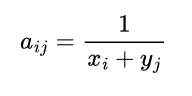
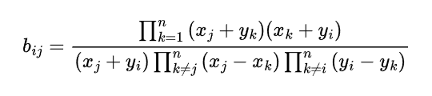

The [Cauchy matrix](https://en.wikipedia.org/wiki/Cauchy_matrix) has the useful properties that all square Cauchy matrices are [invertible](https://en.wikipedia.org/wiki/Invertible_matrix) and every submatrix of a Cauchy matrix is also a Cauchy matrix.
Used together with the useful properties of the [Galois field](https://en.wikipedia.org/wiki/Finite_field) make the Cauchy matrix extremely useful for [erasure coding](https://en.wikipedia.org/wiki/Erasure_code).

With two sequences x and y, which only contain distinctive elements, we can get the Cauchy matrix with the following formula:

If we strictly use a Cauchy matrix without [augmenting](https://en.wikipedia.org/wiki/Augmented_matrix) it, for example with the [identity matrix](https://en.wikipedia.org/wiki/Identity_matrix) to get a [systematic code](https://en.wikipedia.org/wiki/Systematic_code), we have the following formula to directly get the inverse, without having to resort to [decomposition](https://en.wikipedia.org/wiki/Matrix_decomposition) methods:

Formula above taken from:

The Art of Computer Programming  
Volume 1: Fundamental Algorithms  
Donald E. Knuth - 1997  
Paragraph 1.2.3: Sums and Products  
Page 38, Exercise 41

